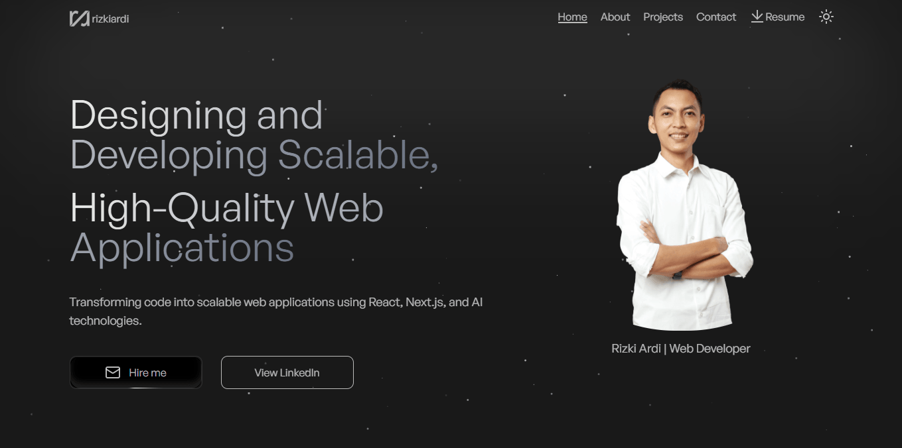

# 🌐 Rizki Ardi - Personal Website

Personal portfolio website of Rizki Ardi, built with React, Vite, and Tailwind CSS.
Features include responsive design, dark mode, resume download, contact page, and sections showcasing projects, skills, and work experience.

🔗 Live Website: https://rizkiardi.vercel.app



## 🛠 Tech Stack

#### Frontend

- React 19
- Vite
- Tailwind CSS
- Shadcn UI
- Framer Motion
- Git & GitHub

#### Deployment

- Vercel

## 🚀 Getting Started

Clone the project

```bash
  git clone https://github.com/rizzkiardi/personal-website-rizkiardi.git
```

Go to the project directory

```bash
  cd personal-website-rizkiardi
```

Install dependencies

```bash
  npm install
```

Run development server

```bash
  npm run dev
```

Open in browser

```bash
  http://localhost:5173/
```

## 📝 License

© 2026 Rizki Ardi. All rights reserved.
